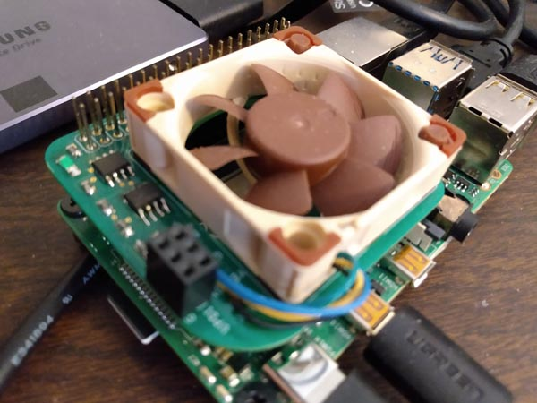

# Raspberry Pi4 Turbo Encabulator


I wanted fan speed control of a 4 wire Noctua fan with PWM, but I didn't want to dedicate one of the Pi's PWM pin for that purpose. I decided to use I2C, a shareable bus, for fan control. Ended up using a small 8 pin Atmel micro controller to support I2C and PWM to the fan. The second 8 pin package is a dual FET to handle 3.3V to 5V conversions.

## Building the Turbo Encabulator hat

You'll find everything you need in the hardware folder. Use the bill of materials file to place your parts order. Also place your board order with the fabricator. Gerber files and Exelon drill files are the standard inputs for the board fab. The design uses surface mount parts, and hand soldering the fine pitch components can be challenging.

## Programming the Atmel ATtiny212

The ATtiny212 packs an amazing amount of capabilities for an 8 bit processor in an 8 pin package. I use it here to implement an I2C slave interface and a PWM generator for the fan. Once the board is built you can use the 3 pin UPDI header and an appropriate programmer to write its software to on-chip flash. No need to purchase a commercial UPDI programmer, look [here](https://www.jsykora.info/2019/04/avr-updi-programmer-from-attiny817-xplained-mini/) for a cheap solution using a $15 ATtiny817 Xplained Mini.

Install and use Atmel Studio 7 to build and flash the ATTiny212.asln project from folder atmel-source using your programmer. Programmer support is built in to Atmel Studio.

## Controlling the fan

Done building and programing the hat. Now to control it.

To build and install the fanmon daemon under Raspbian:

```
sudo make install

sudo cp fanmon.service /etc/systemd/system

sudo systemctl enable fanmon.service
sudo systemctl start fanmon.service
```

This daemon takes periodic temperature measurements and manages the fan to keep the SOC temperature below 70C.

Since this is for Pi 4, might as well take advantage of the new bug free I2C ports. With clock stretching properly supported on the new ports, we can take advantage of the ATtiny212's deep sleep mode to minimize fan circuit power consumption. In your /boot/config.txt file, comment out:

```
#dtparam=i2c_arm=on
```
and add
```
dtoverlay=i2c3,pins_2_3
```
And reboot

That's it! May your Pi never throttle again.
